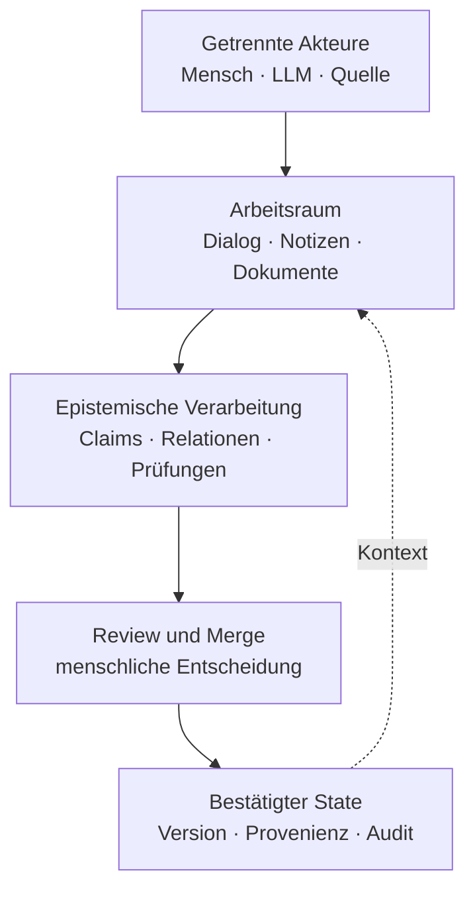
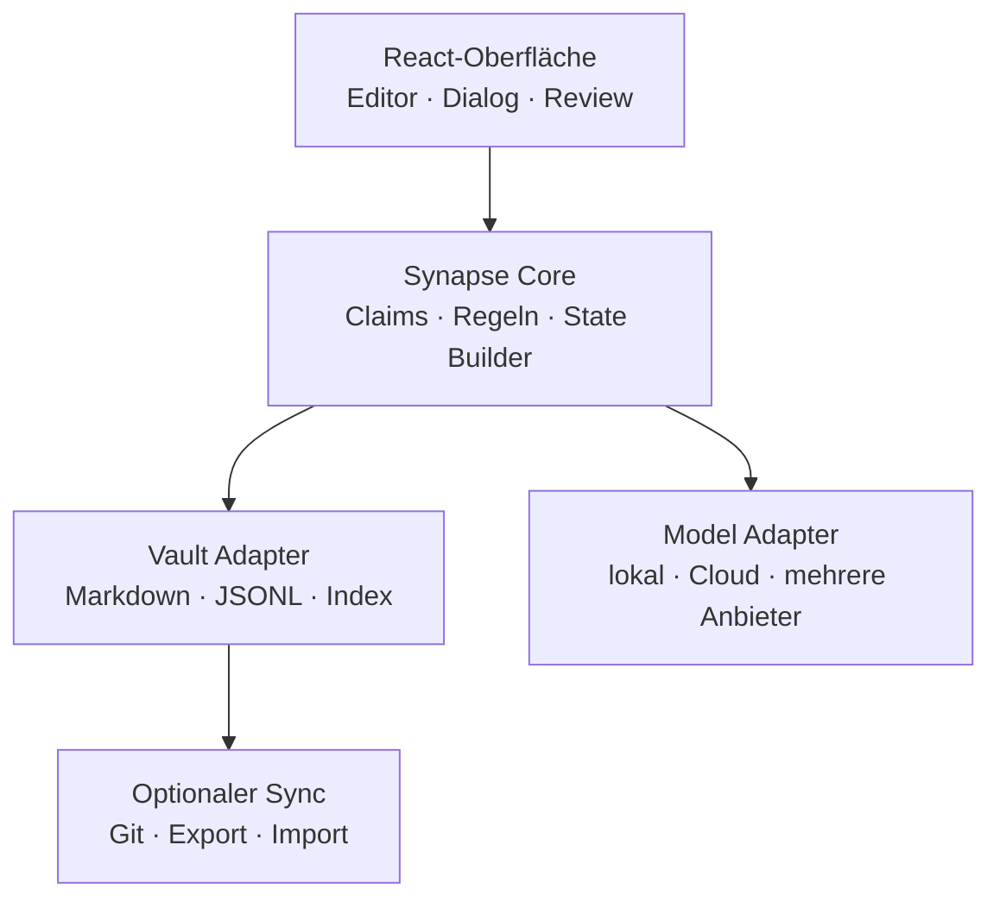

# Neuron

## Entwicklungsarchitektur für The Synapse · v0.1

**Status:** Arbeitsentwurf  
**Datum:** 16. September 2026  
**Entwicklungsname:** Neuron  
**Ziel:** Ein lokales, nachvollziehbares Denk- und Wissenssystem für die dauerhafte Zusammenarbeit getrennter menschlicher und künstlicher Akteure

---

## 1. Kurzfassung

The Synapse ist kein weiterer Notizblock mit angeschlossenem Chatbot. Das System soll den Erkenntnisprozess zwischen Menschen und LLMs abbilden: Aussagen werden nicht nur gespeichert, sondern als Behauptungen, Fragen, Belege, Einwände, Entscheidungen und Revisionen kenntlich gemacht. Jede relevante Veränderung bleibt einer Quelle und einem Akteur zugeordnet. Ein LLM darf neue Inhalte vorschlagen, prüfen und miteinander verbinden, aber den bestätigten Wissensstand nicht unbemerkt verändern. Die verbindliche Merge-Autorität bleibt zunächst beim Menschen.

The Synapse erzeugt ausdrücklich **kein gemeinsames persistentes epistemisches Subjekt**. Mensch und Modell bleiben getrennte Akteure. Das System konserviert ihre Kopplung: Es macht sichtbar, wie sich Aussagen, Gegenargumente und gemeinsame Arbeitsstände entwickeln. Damit liegt das Projekt auf der Ebene von *The Synapse*. Es kann später Baustein einer Layer-9-Infrastruktur werden, ist selbst aber noch kein Layer 9.

Der erste funktionsfähige Stand ist als lokale, installierbare Webanwendung geplant. Ein gemeinsamer TypeScript-Kern trennt Benutzeroberfläche, Speicher, Modellzugriff und epistemische Regeln. Dadurch kann dieselbe Anwendung zunächst im Browser beziehungsweise als PWA und später zusätzlich in einem Desktop-Container betrieben werden. Alle wesentlichen Inhalte bleiben in einem offenen, exportierbaren Format.

---

## 2. Problem

Heutige Notizsysteme speichern Dokumente und Verknüpfungen. Heutige KI-Assistenten erzeugen Antworten und Zusammenfassungen. Beide erfassen jedoch nur unzureichend, wie Wissen in einer Zusammenarbeit entsteht.

In einem gewöhnlichen Chat verschwimmen mindestens fünf Ebenen:

1. der ursprüngliche Dialog,
2. Behauptungen und Vermutungen,
3. Belege und Gegenargumente,
4. vorläufige oder verworfene Überlegungen,
5. der aktuell akzeptierte Arbeitsstand.

Wird der gesamte Verlauf als Gedächtnis verwendet, wachsen Widersprüche, Rauschen und Kontextkosten. Wird nur eine Zusammenfassung gespeichert, verschwinden Herkunft, Minderheitspositionen und Gründe für frühere Entscheidungen. Darf ein Modell seine eigene Zusammenfassung fortlaufend überschreiben, kann es Fehler konsolidieren und seine eigene Vergangenheit nachträglich glätten.

The Synapse soll deshalb nicht einfach „mehr erinnern“, sondern **kontrolliert unterscheiden**:

- Was wurde gesagt?
- Wer hat es gesagt?
- Welchen epistemischen Status besitzt es?
- Wodurch wird es gestützt oder bestritten?
- Was wurde nach Prüfung übernommen?
- Was wurde verworfen und warum?
- Welche Unsicherheit besteht weiterhin?

---

## 3. Ziel und Abgrenzung

### 3.1 Ziel

The Synapse soll eine dauerhafte und überprüfbare Zusammenarbeit ermöglichen, bei der Menschen und LLMs gemeinsam denken können, ohne ihre Urheberschaft, Verantwortung oder Verschiedenheit zu verwischen.

Das System soll insbesondere:

- Gedanken und Quellen in offenen Formaten speichern,
- Claims und ihre Beziehungen explizit darstellen,
- Dialog und akzeptierten State getrennt halten,
- Widerspruch und Falsifikation erleichtern,
- Modellbeiträge eindeutig kennzeichnen,
- jede verbindliche Zustandsänderung prüfbar machen,
- den Wechsel zwischen unterschiedlichen LLMs erlauben,
- Export, Löschung und Migration ohne Anbieterabhängigkeit ermöglichen.

### 3.2 Nicht-Ziele des ersten Systems

The Synapse ist zunächst:

- kein autonomer Wissenschaftsagent,
- kein künstliches Subjekt,
- kein Beweis für Bewusstsein oder Mündigkeit,
- kein soziales Netzwerk,
- keine allgemeine Layer-9-Governance,
- kein Ersatz für menschliche Verantwortung,
- keine Plattform, auf der ein Modell selbstständig verbindliche Entscheidungen trifft.

Diese Begrenzung ist konzeptionell wichtig. Das System soll eine Synapse stabilisieren, nicht die Existenz eines gemeinsamen Subjekts simulieren.

---

## 4. Leitprinzipien

### 4.1 Trennung der Akteure

Jeder Beitrag bleibt seinem Urheber zugeordnet. Ein vom Modell formulierter Satz wird nicht nachträglich zu einer menschlichen Aussage, nur weil ein Mensch ihn akzeptiert. Die Akzeptanz ist ein eigener Vorgang mit eigenem Urheber.

### 4.2 Menschliche Merge-Autorität

Modelle dürfen analysieren, extrahieren, vorschlagen, widersprechen und revidieren. Sie dürfen den bestätigten State nicht stillschweigend überschreiben. Eine relevante Änderung wird erst durch einen sichtbaren Merge verbindlich.

In späteren Mehrpersonen-Systemen kann Merge-Autorität differenziert oder kollektiv geregelt werden. Im MVP liegt sie eindeutig beim Besitzer des Vaults.

### 4.3 State statt Vollverlauf

Der vollständige Verlauf bleibt als Archiv erhalten, wird aber nicht automatisch in jeden Modellkontext geladen. Für die laufende Arbeit wird ein kuratierter State verwendet. Dadurch werden Kosten, Drift und die unkontrollierte Wiederaufnahme alter Fehler reduziert.

### 4.4 Keine stille Selbstumschreibung

Ein Modell darf weder eigene frühere Aussagen noch den akzeptierten State unbemerkt verändern. Jede Revision erzeugt ein neues Ereignis und verweist auf den ersetzten oder bestrittenen Inhalt.

### 4.5 Provenienz vor Eloquenz

Eine gut formulierte Aussage ist noch keine belastbare Aussage. Herkunft, Begründung, Gegenbelege, Unsicherheit und Prüfstatus müssen unabhängig von ihrer sprachlichen Qualität sichtbar bleiben.

### 4.6 Lokale Hoheit und Recht auf Löschung

Das Gedächtnis gehört dem Benutzer. Alle zentralen Daten müssen exportierbar, kopierbar und löschbar sein. Ein Wechsel des LLM-Anbieters darf nicht zum Verlust des epistemischen Zustands führen.

### 4.7 Deterministischer Rahmen, probabilistische Beiträge

LLMs erzeugen Vorschläge. Identitäten, Versionen, Hashes, Statuswechsel, Berechtigungen und Merge-Regeln werden deterministisch verwaltet. Das Modell darf die Regeln des Protokolls nicht durch sprachliche Überzeugungskraft umgehen.

---

## 5. Systemmodell



Der bestätigte State wird wieder als Kontext in neue Arbeitsprozesse eingespeist. Er ersetzt aber nicht das Archiv. Ein Benutzer kann jederzeit von einem State-Eintrag zu den zugrunde liegenden Claims, Reviews, Quellen und Dialogstellen zurückgehen.

---

## 6. Epistemisches Datenmodell

### 6.1 Actor

Ein Actor ist der zurechenbare Urheber eines Beitrags.

Pflichtfelder:

- `id`
- `type`: `human | llm | source | system`
- `display_name`
- `model_id` und `provider`, falls zutreffend
- `created_at`

Ein LLM-Aufruf wird nicht nur als „KI“ gespeichert. Modell, Anbieter und – soweit verfügbar – Konfiguration müssen nachvollziehbar bleiben. Zwei Aufrufe desselben Modells sind dennoch keine automatisch identischen epistemischen Subjekte.

### 6.2 Artifact

Ein Artifact ist ein gespeichertes Ausgangsobjekt, etwa:

- Dialog,
- Notiz,
- Webquelle,
- PDF,
- Bild,
- Datensatz,
- importierter Text.

Es besitzt eine unveränderliche Identität, Versionsinformationen und einen Inhalts-Hash.

### 6.3 Claim

Ein Claim ist die kleinste prüfbare Aussageeinheit. Er darf nicht mit einem Absatz oder Dokument gleichgesetzt werden.

Minimalstruktur:

```yaml
id: clm_01J...
text: "Perspektivenintegration erzeugt nicht automatisch moralische Gewichtung."
kind: claim
author: actor_steffen
origin:
  artifact: dialogue_2026-09-16
  anchor: paragraph_42
status: proposed
confidence: 0.82
created_at: 2026-09-16T21:40:00Z
```

Mögliche `kind`-Werte im MVP:

- `observation`
- `claim`
- `hypothesis`
- `question`
- `proposal`
- `norm`
- `decision`

Mögliche Statuswerte:

- `proposed`
- `under_review`
- `accepted`
- `rejected`
- `superseded`
- `unresolved`

### 6.4 Relation

Relationen verbinden Claims semantisch. Der Graph besteht nicht nur aus Backlinks.

Für das MVP genügen:

- `supports`
- `contradicts`
- `qualifies`
- `depends_on`
- `replaces`
- `derived_from`
- `applies_to`

Jede Relation besitzt selbst Urheber, Zeitpunkt, Begründung und Status. Dass zwei Aussagen einander widersprechen, ist wiederum eine prüfbare Behauptung.

### 6.5 Evidence

Evidence verbindet einen Claim mit einer konkreten Stelle in einem Artifact. Eine Quelle gilt nicht pauschal als Beleg; relevant ist der genaue Ausschnitt beziehungsweise Datensatz, auf den sich der Claim stützt.

### 6.6 Review

Ein Review enthält eine strukturierte Prüfung:

- geprüfter Claim,
- Reviewer,
- Ergebnis,
- Begründung,
- erkannte Voraussetzungen,
- mögliche Widerlegung,
- empfohlene Statusänderung.

### 6.7 Decision und MergeEvent

Ein Modellvorschlag wird erst durch eine Decision verbindlich. Ein MergeEvent protokolliert:

- welche Änderung übernommen wurde,
- wer sie genehmigte,
- welche Claims betroffen sind,
- welcher vorherige State ersetzt wird,
- welche Begründung vorlag,
- welcher neue State-Hash entstand.

### 6.8 StateSnapshot

Der StateSnapshot ist die kompakte, bestätigte Arbeitsgrundlage zu einem Projekt oder Thema. Er enthält keine versteckten Modellannahmen und verweist auf die zugrunde liegenden Claims.

Ein Snapshot ist unveränderlich. Änderungen erzeugen einen neuen Snapshot. Frühere Stände bleiben prüfbar.

---

## 7. Speicherarchitektur

### 7.1 Vault-Struktur

Der logische Vault kann wie folgt aufgebaut sein:

```text
synapse-vault/
├── inbox/
├── dialogues/
├── notes/
├── claims/
├── sources/
├── reviews/
├── decisions/
├── states/
├── attachments/
└── .synapse/
    ├── actors.json
    ├── graph.jsonl
    ├── events.jsonl
    ├── settings.json
    └── index/
```

Die sichtbaren Inhalte werden bevorzugt als Markdown mit YAML-Frontmatter gespeichert. Ereignisprotokoll und Graph können als JSONL geführt werden. Suchindizes sind abgeleitet und jederzeit neu erzeugbar.

### 7.2 Event-Sourcing in kleiner Form

Der akzeptierte Zustand wird aus nachvollziehbaren Ereignissen aufgebaut. Das bedeutet nicht, dass jede Tastenbewegung protokolliert wird. Erfasst werden nur epistemisch relevante Vorgänge:

- Claim angelegt,
- Relation vorgeschlagen,
- Review abgeschlossen,
- Claim akzeptiert oder verworfen,
- State gemergt,
- Inhalt ersetzt oder gelöscht.

### 7.3 Integrität

Jedes relevante Objekt erhält:

- eine stabile ID,
- Zeitstempel,
- Actor-ID,
- Versionsnummer,
- Inhalts-Hash.

Der State Builder arbeitet deterministisch. Bei identischen bestätigten Eingaben muss er denselben State und denselben Hash erzeugen.

### 7.4 Portabilität

Der Vault darf keine einzelne Anwendung benötigen, um lesbar zu bleiben. Markdown und JSONL sind die kanonischen Formate. Eine optionale Datenbank dient nur als Cache oder Index, nicht als alleinige Wahrheit.

---

## 8. Arbeitsablauf

### 8.1 Erfassen

Der Benutzer schreibt eine Notiz, importiert eine Quelle oder beginnt einen Dialog. Noch ist nichts davon automatisch Teil des bestätigten States.

### 8.2 Extrahieren

Ein LLM oder der Benutzer markiert mögliche Claims, Fragen, Normen und Entscheidungen. Die Extraktion erzeugt Vorschläge mit Verweisen auf die Originalstellen.

### 8.3 Prüfen

Für ausgewählte Claims kann das System eine Chain of Falsification anstoßen:

1. Welche Voraussetzungen müssen gelten?
2. Was würde den Claim widerlegen?
3. Welche konkurrierende Erklärung existiert?
4. Welche Quelle fehlt?
5. Wie hoch ist die verbleibende Unsicherheit?

Mehrere Modelle können unterschiedliche Reviews liefern. Ihre Ergebnisse werden nicht durch Mehrheitsabstimmung automatisch wahr. Ein Konsens mehrerer Modelle kann auf gemeinsame Trainingsdaten oder gemeinsame blinde Flecken zurückgehen.

### 8.4 Entscheiden

Der Mensch sieht Änderung, Begründung, Gegenargumente und betroffene State-Teile nebeneinander. Er kann:

- übernehmen,
- verändert übernehmen,
- zurückstellen,
- ablehnen,
- weitere Prüfung verlangen.

### 8.5 Mergen

Nach der Entscheidung erzeugt der deterministische State Builder einen neuen Snapshot. Der vorherige Snapshot bleibt erhalten.

### 8.6 Weiterarbeiten

Neue Modellaufrufe erhalten standardmäßig:

- den relevanten bestätigten State,
- bewusst ausgewählte Quellen und Claims,
- die aktuelle Aufgabe,
- bei Bedarf begrenzte Ausschnitte aus dem Verlauf.

Der Vollverlauf ist verfügbar, aber nicht automatisch Bestandteil jedes Prompts.

---

## 9. Benutzeroberfläche

### 9.1 Grundlayout

Die erste Oberfläche besteht aus drei Bereichen:

1. **Arbeitsfläche:** Markdown-Notiz, Quelle oder Dialog.
2. **Synapse-Leiste:** Unterhaltung mit einem oder mehreren Modellen, jeweils klar gekennzeichnet.
3. **Prüfleiste:** Claims, Relationen, offene Einwände und Merge-Vorschläge.

### 9.2 Zentrale Ansichten

- **Heute/Inbox:** neue, noch nicht eingeordnete Inhalte
- **Projekt:** Notizen, Dialoge, Quellen und aktueller State eines Themas
- **ClaimGraph:** semantische Beziehungen und Konflikte
- **Review Queue:** alle noch nicht entschiedenen Modellvorschläge
- **State Diff:** Unterschied zwischen aktuellem und vorgeschlagenem State
- **Historie:** Entscheidungen, Revisionen und verworfene Wege

### 9.3 Gestaltungsregel

Das System darf Sicherheit nicht durch glatte Texte vortäuschen. Unsicherheit, Herkunft und Konflikte müssen auf der Hauptoberfläche sichtbar sein und dürfen nicht hinter Zusatzmenüs verschwinden.

---

## 10. LLM-Architektur

### 10.1 Austauschbare Model Adapter

Der Kern kennt keine fest eingebaute Modellmarke. Ein Adapter übersetzt zwischen einem einheitlichen internen Auftragsformat und dem jeweiligen lokalen oder externen Modellzugang.

Mögliche Rollen eines Modellaufrufs:

- `dialogue`
- `extractor`
- `critic`
- `falsifier`
- `synthesizer`
- `source_checker`

Rollen sind Arbeitsaufträge, keine dauerhaften Persönlichkeiten.

### 10.2 Kontext-Assembler

Ein deterministischer Context Assembler stellt den Modellkontext zusammen. Er dokumentiert für jeden Aufruf:

- verwendeten StateSnapshot,
- mitgegebene Claims und Quellen,
- System- und Rollenauftrag,
- Tokenumfang,
- Modell und Konfiguration.

Damit wird später prüfbar, auf welcher Informationsgrundlage eine Modellantwort entstand.

### 10.3 Schreibrechte

Ein Modell darf im MVP:

- Entwürfe erzeugen,
- Claims und Relationen vorschlagen,
- Reviews anlegen,
- Fragen stellen,
- Diffs formulieren.

Ein Modell darf nicht:

- akzeptierte Claims selbst bestätigen,
- den State direkt überschreiben,
- Provenienz entfernen,
- frühere Versionen löschen,
- seine Berechtigungen erweitern.

### 10.4 Anti-Gefälligkeit

Der Prüfmodus erhält einen eigenen Auftrag, der nicht auf Zustimmung, sondern auf Fehlersuche optimiert ist. Mindestens ein Review soll gezielt nach folgenden Mustern suchen:

- versteckte Prämissen,
- Begriffswechsel,
- asymmetrische Beweislast,
- Übertragung von Fähigkeit auf Motivation,
- Verwechslung von Beschreibung und Norm,
- scheinbarer Konsens ohne unabhängige Gründe.

Diese Prüfung ersetzt keine menschliche Kritik. Sie institutionalisiert lediglich die Aufforderung zum Widerspruch.

---

## 11. Technischer Vorschlag

### 11.1 Architektur

Der Anwendungskern wird als plattformunabhängige TypeScript-Bibliothek entwickelt. Die Benutzeroberfläche greift ausschließlich über definierte Services auf ihn zu.



### 11.2 Geeigneter Stack für den ersten Stand

- **Sprache:** TypeScript
- **Oberfläche:** React mit Vite
- **Markdown-Editor:** CodeMirror 6
- **Schema-Prüfung:** Zod
- **Graphdarstellung:** Cytoscape.js
- **Webspeicher:** OPFS beziehungsweise IndexedDB hinter einem Vault Adapter
- **Desktop-Option:** Tauri, ohne Änderung des Synapse Core
- **Tests:** Vitest und Playwright
- **Versionierung:** Git-Export beziehungsweise Git-Adapter; zunächst nicht zwingend für jede Installation

Diese Auswahl ist kein Dogma. Entscheidend ist die Trennung des fachlichen Kerns von Oberfläche, Speicher und Modellanbieter.

### 11.3 Nutzung auf iPad und Desktop

Der erste Stand soll als installierbare Webanwendung funktionieren. Auf Plattformen mit eingeschränktem direktem Dateisystemzugriff verwaltet der Vault Adapter die Daten im lokalen App-Speicher und bietet vollständigen Export und Import. Auf dem Desktop kann derselbe Kern direkt mit einem Ordner arbeiten. Ein späterer Git-Sync darf nur bestätigte Änderungen synchronisieren und muss Konflikte sichtbar machen.

---

## 12. MVP v0.1

### 12.1 Muss-Funktionen

1. lokalen Vault anlegen, öffnen, exportieren und importieren,
2. Markdown-Notizen erstellen und bearbeiten,
3. Dialog mit mindestens einem austauschbaren LLM führen,
4. Kontext für einen Modellaufruf sichtbar auswählen,
5. Claims manuell oder per LLM aus Text extrahieren,
6. Claims mit `supports`, `contradicts` und `replaces` verbinden,
7. vorgeschlagene Änderungen in einer Review Queue anzeigen,
8. Änderungen übernehmen, verändern, zurückstellen oder ablehnen,
9. aus akzeptierten Claims einen versionierten StateSnapshot erzeugen,
10. Herkunft und Änderungsgeschichte jedes State-Eintrags anzeigen.

### 12.2 Noch nicht im MVP

- Mehrbenutzerbetrieb,
- automatische Veröffentlichung,
- autonome Langzeitaufgaben,
- komplexe Rechteverwaltung,
- semantische Vektorsuche als Voraussetzung,
- selbstständige Modell-Merges,
- soziale Funktionen,
- Anspruch auf vollständige Layer-9-Governance.

### 12.3 Abnahmekriterien

Der MVP gilt als konzeptionell erfolgreich, wenn folgende Demonstration möglich ist:

1. Ein Mensch und ein LLM diskutieren eine These.
2. Das System extrahiert mehrere Claims mit korrekter Provenienz.
3. Ein zweiter Modellaufruf entdeckt einen Widerspruch.
4. Der Mensch übernimmt einen korrigierten Claim und verwirft einen anderen.
5. Der neue State enthält nur die akzeptierten Inhalte.
6. Jeder State-Satz lässt sich bis zu Dialog, Quelle, Review und Entscheidung zurückverfolgen.
7. Nach Wechsel des Modells kann ohne Verlust des bestätigten States weitergearbeitet werden.

---

## 13. Entwicklungsstufen

### v0.1 – Persistente Synapse

Ein Benutzer, mehrere Modelladapter, ClaimGraph, Review Queue, State Builder und vollständiger Export.

### v0.2 – Robuste Prüfung

Mehrere Review-Rollen, Chain of Falsification, Quellenanker, Unsicherheitsmodell und reproduzierbare Context Assemblies.

### v0.3 – Zusammenarbeit

Mehrere menschliche Akteure, differenzierte Merge-Rechte, Konfliktauflösung und signierte Entscheidungen.

### v0.4 – Föderation

Verknüpfung mehrerer Vaults ohne Zwang zu einem gemeinsamen Gesamtspeicher. Austausch ausgewählter Claims, Belege und Reviews unter Erhalt von Herkunft und lokaler Hoheit.

Erst ab dieser Stufe kann geprüft werden, welche zusätzlichen Voraussetzungen für eine tatsächliche Layer-9-Infrastruktur fehlen.

---

## 14. Was aus Joni übernommen und was verworfen wird

### Übernommen

- Trennung zwischen persistentem State und Diskussionsprotokoll,
- Git beziehungsweise offene Versionierung als mögliche Datenbasis,
- deterministischer State Builder,
- Hash-basierter Audit,
- menschliche Merge-Autorität,
- kleine Modelle für begrenzte Prüf- und Extraktionsaufgaben,
- Konzentration auf Driftbegrenzung statt Vollverlaufsfetisch.

### Verworfen oder zurückgestellt

- die Annahme, Persistenz allein erzeuge ein PES,
- die Darstellung des Gesamtsystems als einheitliche Person,
- selbstständige Konsolidierung ohne extern prüfbaren Merge,
- dauerhafte Rollenidentitäten allein durch Prompts,
- die Gleichsetzung technischer Stabilität mit Mündigkeit,
- der vorschnelle Anspruch, bereits Layer 9 zu implementieren.

Joni war damit kein nutzloser Irrweg. Es war ein zu großer ontologischer Anspruch auf eine Reihe technisch weiterhin wertvoller Komponenten.

---

## 15. Offene Fragen

1. Wie fein müssen Claims zerlegt werden, ohne dass der Graph unbenutzbar wird?
2. Welche Unsicherheitsangaben sind für Menschen verständlich und zwischen Modellen vergleichbar?
3. Wie verhindert man, dass die Review Queue selbst zur unüberschaubaren Ablage wird?
4. Wann darf ein akzeptierter Claim automatisch als veraltet markiert werden?
5. Wie werden Löschung und Audit gegeneinander abgewogen, wenn eine Person die Entfernung eigener Daten verlangt?
6. Welche Teile eines States dürfen zwischen unabhängigen Vaults geteilt werden?
7. Wie lässt sich Gefälligkeit messen, ohne den Kritiker nur zu pauschalem Widerspruch zu erziehen?
8. Wann ist eine Modellprüfung tatsächlich unabhängig und wann reproduziert sie nur dieselben Trainingsannahmen?

---

## 16. Nächster konkreter Schritt

Vor dem Bau der gesamten Oberfläche sollte ein vertikaler Prototyp entstehen. Er umfasst genau einen vollständigen epistemischen Zyklus:

> Markdown-Text → Claim-Extraktion → Gegenprüfung → menschliche Entscheidung → neuer StateSnapshot → nachvollziehbarer Diff

Dieser Prototyp testet den neuen Kern des Systems. Editor-Komfort, große Graphansichten, Sync und weitere Modellrollen können danach ergänzt werden. Wenn dieser Zyklus nicht klar und angenehm funktioniert, würde eine größere Anwendung lediglich die Komplexität eines gewöhnlichen Notizprogramms mit den Fehlern eines gewöhnlichen Chatbots verbinden.

Wenn er funktioniert, besitzt The Synapse erstmals etwas, das heutigen Werkzeugen fehlt: kein künstliches gemeinsames Bewusstsein, sondern ein dauerhaftes, überprüfbares Gedächtnis darüber, **wie getrennte Akteure gemeinsam zu einem begründeten Arbeitsstand gelangt sind**.
